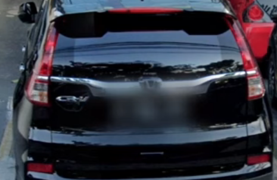

Asia: South and East
====================

.. image:: images/south_east_asia_coverage.png
  :width: 100%

Bangladesh 🇧🇩
-------------

**Meta**
    - Google car with the roof racks visible.
    
Bhutan 🇧🇹
---------

**Cars**
	- Red plates

Cambodia 🇰🇭
-----------

India 🇮🇳
--------

Indonesia 🇮🇩
------------

**License plate**
    - Often there are black plates (also in Singapore and Malaysia). They usually have 3 white sections, instead of 2 (Malaysia).

Japan 🇯🇵
--------

**Google car**

- Low camera

Laos 🇱🇦 
-------

**Cars**
	- Yellow plates.

Malaysia 🇲🇾
-----------

**License plate**
    - Often there are black plates (also in Indonesia and Singapore). They usually have 2 white sections, instead of 3 (Indonesia).

Philippines 🇵🇭
--------------

**Cars**
	- Taxis can have green plates.

Singapore 🇸🇬
------------

**License plate**
    - Often there are black plates (also in Indonesia and Malaysia).

South Korea 🇰🇷
--------------

Sri Lanka 🇱🇰
------------

Taiwan 🇹🇼
---------

**Road signs**
    - Poles next to the street are coloured black and yellow.

.. image:: images/taiwan-pole.png
  :width: 400
  :alt: Poles in Taiwan.

Thailand 🇹🇭
-----------

**Cars**
	- White plates
