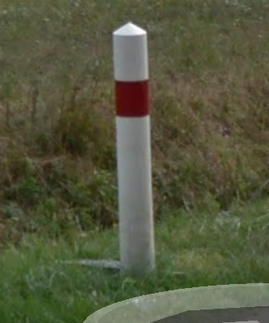

Europe
======

Albania
-------

**License plate**
	- 2011-: two blue strips on the left and right.
	- 2002-2011: red strip on the left.

**Language**
	- 'Rruga' means street.

**Meta**
	- Ridges in the sky.

Andorra
-------

**License plate**

- Shorter plate without a blue strip.

Austria
-------

**Road signs**
	- Bus stop: round sign with yellow background, green border and a green "H" in the middle.
	- White bollards with red strip and black top. This bollard is similar to that used in Slovenia and Montenegro. The red strip can also be black (this is less common in Slovenia and Montenegro).

.. image:: images/austria-bollard.png
  :width: 200
  :alt: The bollard in Austria.

Belarus
-------

**License plate**

- No blue strip, but red and green flag on the left.

**Road signs**

- Give way to incoming traffic: arrows heads are close rather than the arrows being next to each other

Belgium
-------

**License plate**

- Blue strip but red border and letters.

Bulgaria
--------

**Road signs**
	- White hexagonal looking bollards with black band and red strip

Croatia
-------

Czech Republic
--------------

**Road signs**
	- White bollards with black bit with two red rectangles on one side and a white rectangle on the other.

.. image:: images/czechia-bollard.png
  :width: 200
  :alt: The bollard in Czechia.

Denmark
-------

**Road signs**
	- Bus stop: yellow sign with a bus.
	- White bollards with red strip and funky yellow patch.

.. image:: images/denmark-bollard.png
  :width: 200
  :alt: The bollard in Denmark.

Estonia
-------

**Road signs**

- Give way to incoming traffic: arrows heads are close rather than the arrows being next to each other

Faroe Islands
-------------

Finland
-------

**Road signs**
	- Yellow filling for priority, warnings and prohibitory signs.
	- Bus stop: yellow sign with a bus.

**Road markings**
	- The double continuous lines in the middle of the street can be yellow.
	- There can be one continuous yellow line and one white dashed line in the middle of the street.

France
------

**License plate**
	- Before 2009 they were yellow with one blue strip on the left
	- After 2009 they are white with a blue strip on the left and a strip with blue background and the logo of the region on the right.

**Road signs**
	- Pointy white bollards with red strip

Germany
-------

**Road signs**

- Bus stop: round sign with yellow background, green border and a green "H" in the middle.

Greece
------

**Road signs**

- Yellow filling for warnings and give way sign (all triangular).

Hungary
-------

**Language**
- 'Utca' means street

Iceland
-------

**License plate**

- No blue strip, but flag on the left. Blue letters.

**Road signs**

- Yellow filling for priority, warnings and prohibitory signs.

Ireland
-------

Isle of Man
-----------

**License plate**

- Red strip on the left

Italy
-----

**License plate**

- Two blue strips.

Latvia
------

**Language**
	- 'Iela' means street

Lichtenstein
------------

**License plate**

- Black plates

Lithuania
---------

**Language**
	- Words often end in AI or AS

Luxembourg
----------

**License plate**

- Yellow plate with blue strip on the left

Malta
-----

Moldova
-------

**Road signs**

- Give way to incoming traffic: arrows heads are close rather than the arrows being next to each other

Monaco
------

**License plate**

- Shorter, no blue strips and blue writing.

Montenegro
----------

**Meta**
	- Ridges in the sky.

Netherlands
-----------

**License plate**

- Yellow plate with blue strip on the left

North Macedonia
---------------

**Languages**

- Macedonian (cyrillic alphabet) spoken by 66% and Albanian (roman alphabet) spoken by 25%.

**Road signs**

- Yellow filling for give way sign (triangular).

Norway
------

Poland
------

**Road signs**
	- Yellow filling and thin red border for warnings and give way sign (all triangular).
	- White bollards with red strip

.. image:: images/poland-bollard.png
  :width: 200
  :alt: The bollard in Poland.

Portugal
--------

**License plates**

- 2005-2020: blue strip on the left, yellow strip on the right
- 2020-: only blue strip on the left.

Romania
-------

**Road signs**

- Thick red border on give way sign.

San Marino
----------

**License plate**

- Shorter plate, no blue strip, blue writing.

Serbia
------

**Websites**
- Domain name ends with ``.rs``.

Slovakia
--------

Slovenia
--------

**License plate**

- Green border around the plate

Spain
-----

Sweden
------

**Road signs**
	- Yellow filling for priority, warnings and prohibitory signs.

**Websites**
	- Domain name ends in ``.se``

Switzerland
-----------

**License plate**

- No blue strip on the left, but a flag on the left and another symbol on the right.

**Google car**

- Low camera

Turkey
------

**License plate**

- Blue strip on the left

**Road signs**

- Stop sign: "DUR" instead of "STOP"
- Bus stop: blue square sign with a "D" with white background.

Ukraine
-------

**Road signs**
	- Give way to incoming traffic: arrows heads are close rather than the arrows being next to each other

**Meta**
	- Often the Google car is red with an antenna. Occasionally, this can be seen in Belgium.

United Kingdom
--------------

**License plate**

- Different front and back plates. Front is white, back is yellow. Both have a blue strip on the left.

**Road signs**

- Give way to incoming traffic: one arrow much bigger than the other
- Bus stop: white sign with a bus

