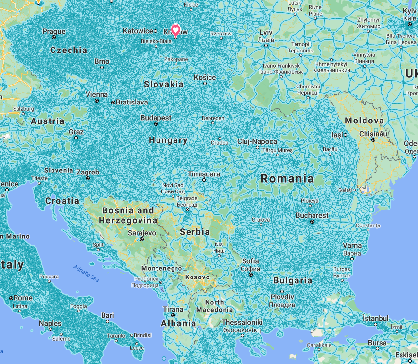
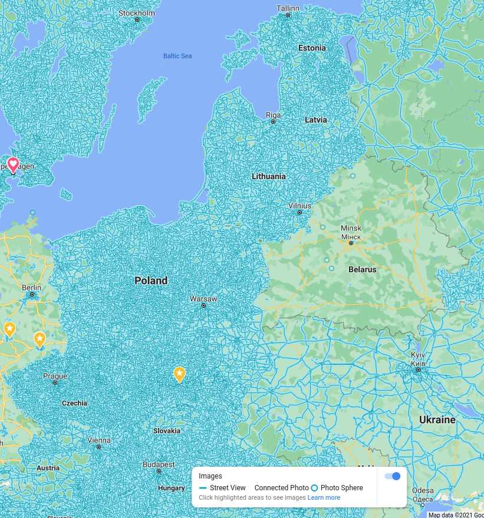
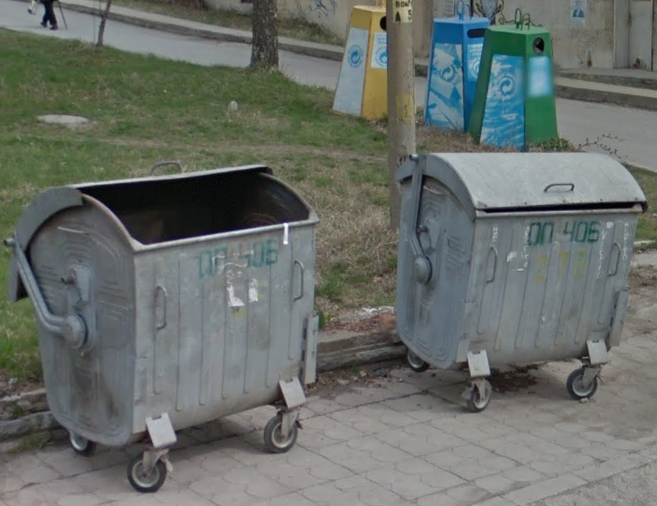
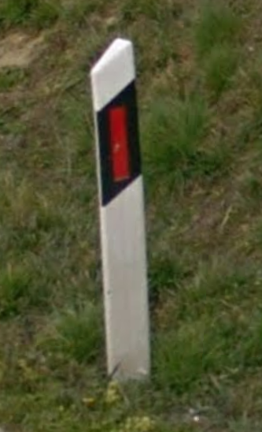
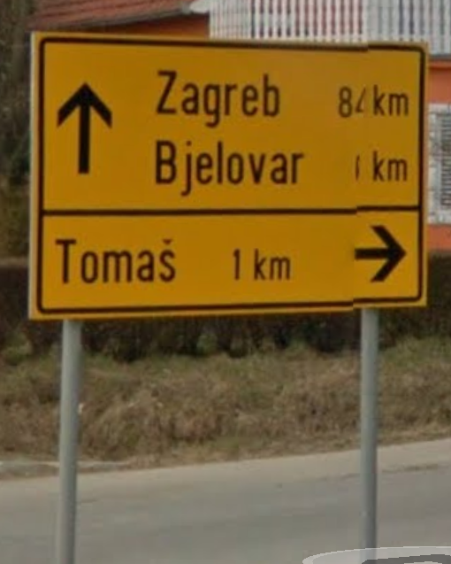
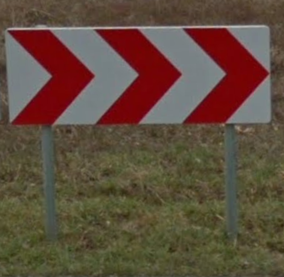

Europe: East
============

Albania 🇦🇱
----------

**License plate**
    - 2011-: two blue strips on the left and right.
    - 2002-2011: red strip on the left.

**Language**
    - 'Rruga' means street.

**Meta**
    - Ridges in the sky.

Belarus 🇧🇾
----------

**License plate**
    - No blue strip, but red and green flag on the left.

**Road signs**
    - Give way to incoming traffic: arrows heads are close rather than the arrows being next to each other

Bulgaria 🇧🇬
-----------

**Road signs**
    - White hexagonal looking bollards with black band and red strip

**Landscape**
    - Metal bins

.. image:: images/bulgaria-bollard.png
  :height: 250

Croatia 🇭🇷
----------

**Meta**
    - Can have winter coverage.

Czech Republic
--------------

**Road signs**
    - White bollards with black bit with two red rectangles on one side and a white rectangle on the other (same as Slovakia).

.. image:: images/czechia-bollard.png
  :width: 800
  :alt: The bollard in Czechia.

Hungary 🇭🇺
----------

**Language**
    - 'Utca' means street

Moldova 🇲🇩
----------

**Road signs**
    - Give way to incoming traffic: arrows heads are close rather than the arrows being next to each other

Montenegro 🇲🇪
-------------

**Meta**
    - Ridges in the sky.

North Macedonia 🇲🇰
------------------

**Languages**
    - Macedonian (cyrillic alphabet) spoken by 66% and Albanian (roman alphabet) spoken by 25%.

**Road signs**
    - Yellow filling for give way sign (triangular).

**Cars**
    - White plates

Poland 🇵🇱
---------

**Road signs**
    - Yellow filling and thin red border for warnings and give way sign (all triangular).
    - White bollards with red strip

.. image:: images/poland-bollard.png
  :width: 200
  :alt: The bollard in Poland.

Romania 🇷🇴
----------

**Road signs**
    - Thick red border on give way sign.

Serbia 🇷🇸
---------

**Websites**
    - Domain name ends with ``.rs``.

Slovakia 🇸🇰
-----------

**Road signs**
    - White bollards with black bit with two red rectangles on one side and a white rectangle on the other (same as Czechia).

.. image:: images/czechia-bollard.png
  :width: 800
  :alt: The bollard in Slovakia.

Slovenia 🇸🇮
-----------

**License plate**
    - Green border around the plate

Turkey 🇹🇷
---------

**License plate**
    - Blue strip on the left

**Road signs**
    - Stop sign: "DUR" instead of "STOP"
    - Bus stop: blue square sign with a "D" with white background.

Ukraine 🇺🇦
----------

**Road signs**
    - Give way to incoming traffic: arrows heads are close rather than the arrows being next to each other

**Meta**
    - Often the Google car is red with an antenna. Occasionally, this can be seen in Belgium.

**Cars**
    - License plate has a strip with the flag colours on the left.
