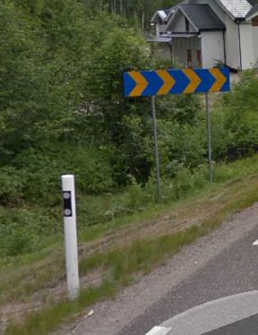
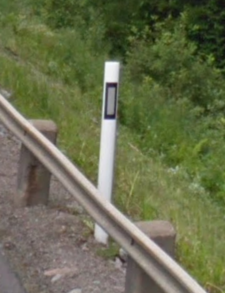

Europe: North and Baltic
========================

Denmark 🇩🇰
----------

**Road signs**
    - Bus stop: yellow sign with a bus.
    - White bollards with red strip and funky yellow patch.

.. image:: images/denmark-bollard.png
  :width: 200
  :alt: The bollard in Denmark.

Greenland 🇬🇱
------------

Norway 🇳🇴
---------

**License plates**
    - Commercial vehicles have green plates.

Sweden 🇸🇪
---------

**Road signs**
    - Yellow filling for priority, warnings and prohibitory signs.
    - Cylindrical bollards. The reflective strip can be white or yellow.

.. image:: images/sweden-signs.png
  :height: 250

**Websites**
    - Domain name ends in ``.se``

Finland 🇫🇮
----------

**Road signs**
    - Yellow filling for priority, warnings and prohibitory signs.
    - Bus stop: yellow sign with a bus.

**Road markings**
    - The double continuous lines in the middle of the street can be yellow.
    - There can be one continuous or dashed yellow line and one white dashed line in the middle of the street.

Iceland 🇮🇸
----------

**License plate**
    - No blue strip, but flag on the left. Blue letters.

**Road signs**
    - Yellow filling for priority, warnings and prohibitory signs.

Estonia 🇪🇪
----------

**Road signs**
    - Give way to incoming traffic: arrows heads are close rather than the arrows being next to each other

Latvia 🇱🇻
---------

**Language**
    - 'Iela' means street

Lithuania 🇱🇹
------------

**Language**
    - Words often end in AI or AS

