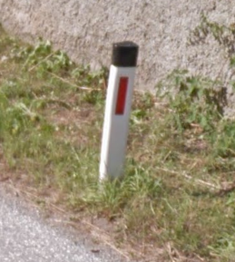
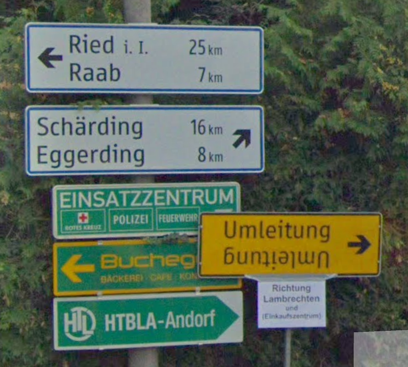
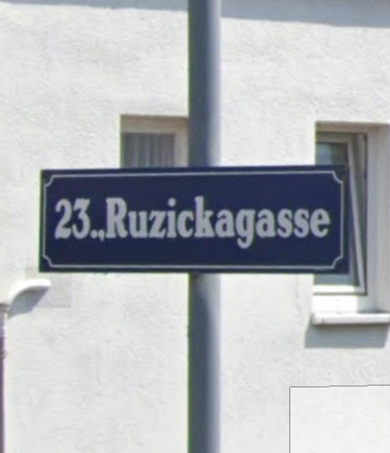
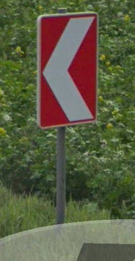
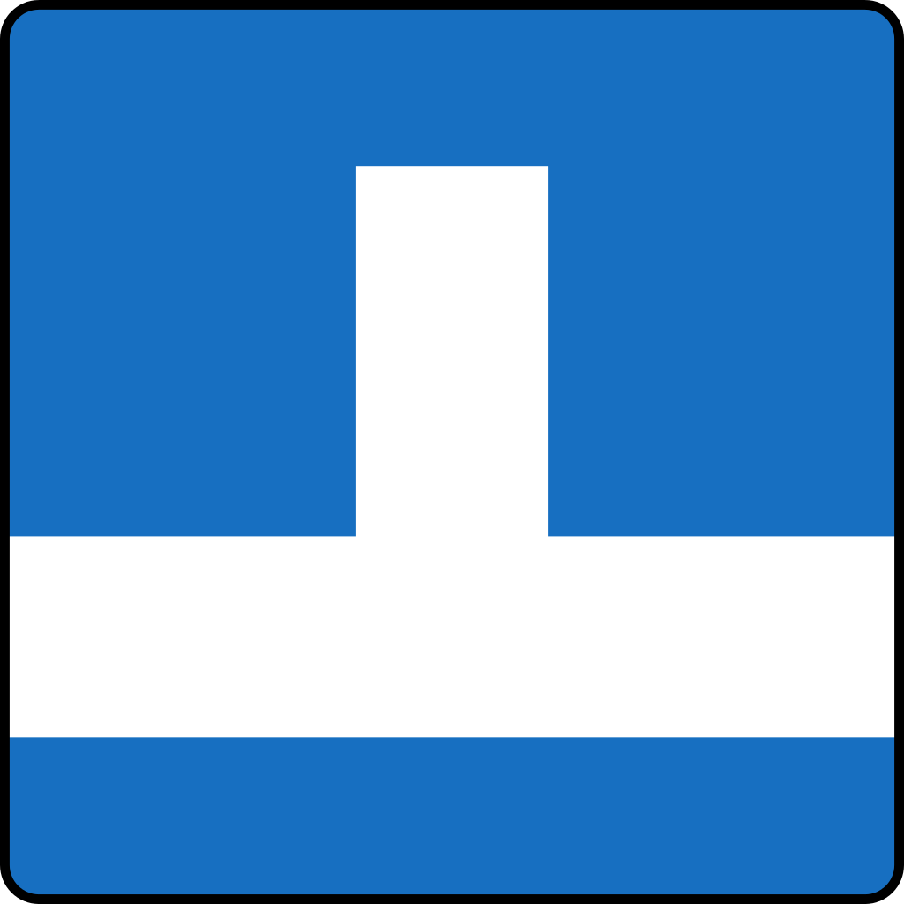
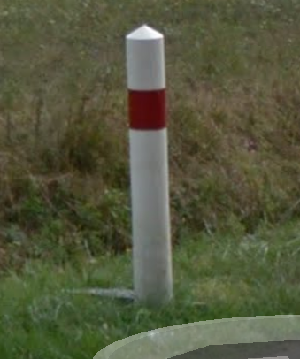
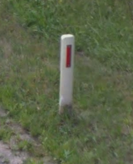

Europe: West and South
======================

Andorra 🇦🇩
----------

**License plate**
    - Shorter plate without a blue strip.

Austria 🇦🇹
----------

**Road signs**
    - Bus stop: round sign with yellow background, green border and a green "H" in the middle.
    - White bollards with red strip and black top. This bollard is similar to that used in Slovenia and Montenegro. The red strip can also be black (this is less common in Slovenia and Montenegro).

Belgium 🇧🇪
----------

**Cars**
    - Blue strip but red border and letters.

France 🇫🇷
---------

**License plate**
    - Before 2009 they were yellow with one blue strip on the left
    - After 2009 they are white with a blue strip on the left and a strip with blue background and the logo of the region on the right.

**Road signs**
    - Pointy white bollards with red strip

Germany 🇩🇪
----------

**Road signs**
    - Bus stop: round sign with yellow background, green border and a green "H" in the middle.

Greece 🇬🇷
---------

**Road signs**
    - Yellow filling for warnings and give way sign (all triangular).

Italy 🇮🇹
--------

**License plate**
    - Two blue strips.

Lichtenstein
------------

**License plate**
    - Black plates

Luxembourg 🇱🇺
-------------

**License plate**
    - Yellow plate with blue strip on the left

Malta 🇲🇹
--------

Monaco 🇲🇨
---------

**License plate**
    - Shorter, no blue strips and blue writing.

Netherlands 🇳🇱
--------------

**License plate**
    - Yellow plate with blue strip on the left

Portugal 🇵🇹
-----------

**License plates**
    - 2005-2020: blue strip on the left, yellow strip on the right
    - 2020-: only blue strip on the left.

San Marino 🇸🇲
-------------

**License plate**
    - Shorter plate, no blue strip, blue writing.

Spain 🇪🇸
--------

Switzerland 🇨🇭
--------------

**License plate**
    - Not "european" license plate (i.e no blue strip on the left), but a flag on the left and another symbol on the right.

**Road signs**
    - Yellow pedestrian crossings.
    - Back side of (circular?) signs have a "cross".

**Google car**
    - Low camera
