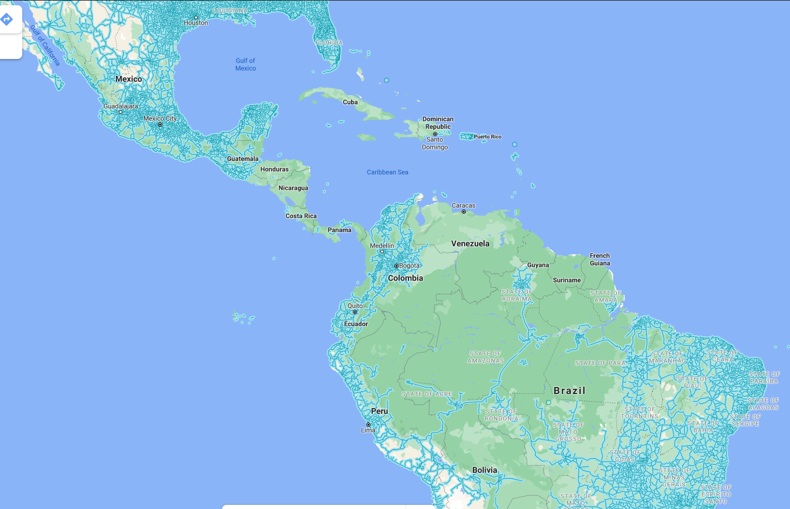
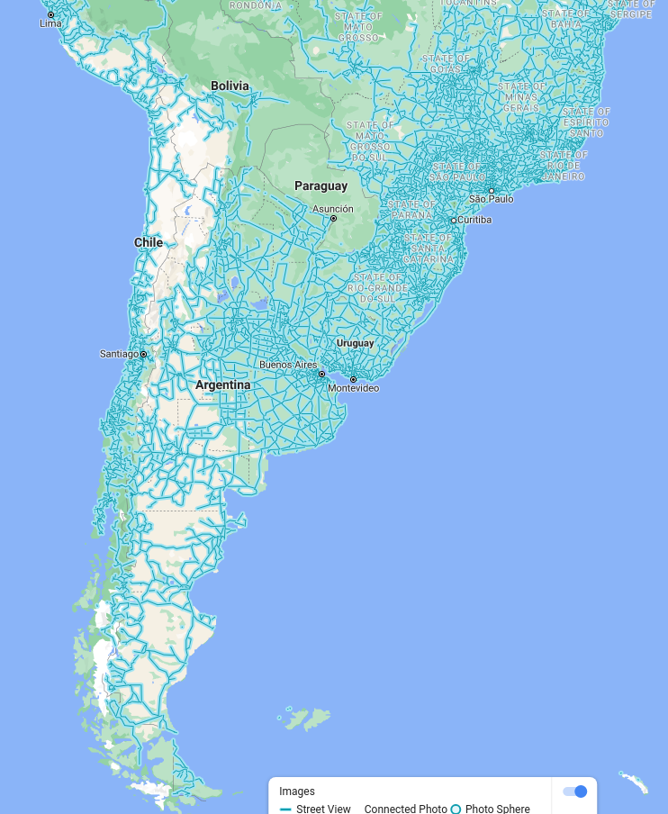
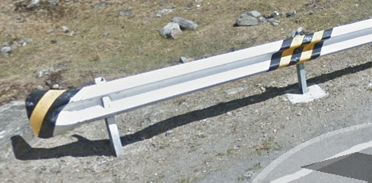

America: South and Central
==========================

Argentina 🇦🇷
------------

**Cars**
	- White license plate with a black dot in the middle.

Bolivia 🇧🇴
----------

Brazil 🇧🇷
---------

**Road signs**
    - Back side of road signs is black

Chile 🇨🇱
--------

**Road lines**
	- Usually has all white lines.

Colombia 🇨🇴
-----------

**Cars**
	- Yellow license plates (exept taxis which have white plates).

Ecuador 🇪🇨
----------

Peru 🇵🇪
-------

**Road signs**
	- Guard rail with yellow and black lines.

Uruguay 🇺🇾
----------

**Road lines**
    - Can have a three lines in the middle. The outer 2 yellow, the middle one white and dashed.

Dominican Republic 🇩🇴
---------------------

Guatemala 🇬🇹
------------

Mexico 🇲🇽
---------

Puerto Rico 🇵🇷
--------------

